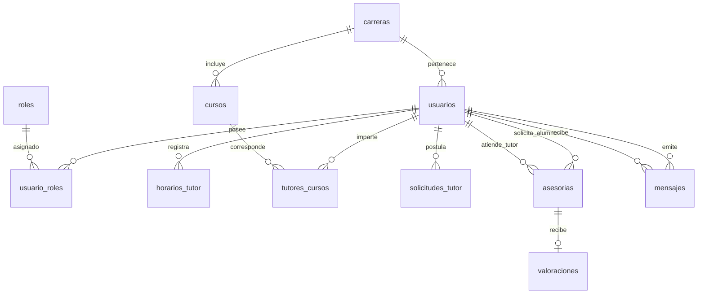

# Guía de Exposición — Backend (Node.js & Express)
**UNAMConnect — Portal de Tutorías Académicas**

Esta guía está diseñada para respaldar la explicación técnica del **Backend** durante la exposición ante el jurado o docente. Contiene la fundamentación de la arquitectura de la API REST, la justificación de tecnologías, el desglose detallado de todos los controladores, modelos, rutas y middlewares, y un guion estructurado paso a paso para la sustentación backend.

---

## 1. Introducción y Arquitectura del Backend 🚀

El backend de **UNAMConnect** es un servidor de servicios **API RESTful** desarrollado sobre **Node.js** y **Express.js**, conectado a una base de datos relacional **PostgreSQL** y respaldado por **Firebase Admin SDK**.

### Principios Arquitectónicos Aplicados:
1. **Patrón MVC (Modelo - Vista - Controlador)**:
   * **Rutas (`routes/`)**: Definen las URIs y los verbos HTTP (`GET`, `POST`, `PUT`, `DELETE`).
   * **Middlewares (`middlewares/`)**: Filtran las peticiones, verifican tokens JWT, validan entradas y gestionan subida de archivos.
   * **Controladores (`controllers/`)**: Contienen la lógica de negocio pura y la orquestación de operaciones.
   * **Modelos (`models/`)**: Ejecutan consultas SQL puras y parametrizadas sobre PostgreSQL a través del pool de conexiones `pg`.
2. **Autenticación sin Estado (Stateless)**: Basada en tokens **JWT (JSON Web Tokens)**. El servidor no mantiene variables de sesión en memoria, permitiendo escalar horizontalmente.
3. **Persistencia Híbrida**: Datos relacionales y estructurados en PostgreSQL; archivos pesados y expedientes académicos en **Firebase Storage**.

---

## 2. Tecnologías Aplicadas y Justificación Técnica 🛠️

Durante la exposición, el docente preguntará: **¿Por me eligieron Node.js, Express y PostgreSQL para el Backend?** A continuación se detalla la respuesta técnica justificada:

### 1. **Node.js & Express.js**
* **¿Por qué se eligió?**: Node.js utiliza un bucle de eventos (*Event Loop*) monohilo basado en E/S no bloqueante (*Asynchronous Non-blocking I/O*). Esto lo hace excepcionalmente rápido para atender miles de peticiones simultáneas con bajo consumo de memoria RAM. Express es el framework web estándar de facto en Node.js, ofreciendo un sistema de middlewares altamente flexible.

### 2. **PostgreSQL (`pg` Driver)**
* **¿Por qué se eligió?**: UNAMConnect requiere transaccionalidad estricta y cumplimiento **ACID** (Atomicidad, Consistencia, Aislamiento y Durabilidad). PostgreSQL maneja de forma óptima llaves foráneas complejas (alumnos agendando horarios con tutores autorizados en materias específicas) y previene inconsistencias de concurrencia mediante transacciones.

### 3. **JSON Web Tokens (JWT) & bcrypt**
* **¿Por qué se eligió?**: `bcrypt` aplica un algoritmo de hashing salado (*salted hash*) de alta seguridad para almacenar las contraseñas en la base de datos sin guardarlas jamás en texto plano. `JWT` permite firmar criptográficamente los datos de la sesión del usuario para verificar su identidad y rol en cada petición.

### 4. **Firebase Admin SDK**
* **¿Por me eligió?**: Proporciona integración directa con Firebase Storage para la carga y descarga de expedientes (boletas de notas en PDF e imágenes de perfil) mediante URLs firmadas y buckets seguros.

### 5. **Multer Middleware**
* **¿Por qué se eligió?**: Facilita el procesamiento de peticiones multipart/form-data para recibir archivos subidos por los usuarios, realizando filtrado previo por tipo MIME (PDF, PNG, JPG) antes de enviarlos al almacenamiento.

---

## 3. Estructura del Proyecto Backend 📂

```
backend/
├── config/                      # Configuraciones globales y conexiones
│   ├── db.js                    # Pool de conexiones a PostgreSQL (librería 'pg')
│   └── firebase-service-account.json # Clave privada de Firebase Admin SDK
├── controllers/                 # Lógica de Negocio (Controladores)
│   ├── auth.controller.js       # Autenticación, Login y Registro
│   ├── usuarios.controller.js   # Gestión de usuarios, perfiles y claves
│   ├── asesorias.controller.js  # Agendamiento, enlaces de Google Meet y estados
│   ├── horarios.controller.js   # Disponibilidad horaria en formato 24h (Lunes-Sábado)
│   ├── cursos.controller.js     # Catálogo de materias por ciclo y carrera
│   ├── tutoresCursos.controller.js # Materias autorizadas por tutor y toggles
│   ├── solicitudes.controller.js# Evaluación de postulaciones a tutor por moderador
│   ├── mensajes.controller.js   # Chat en tiempo real y mensajes no leídos
│   ├── notificaciones.controller.js # Emisión y lectura de avisos
│   ├── recursos.controller.js   # Guías de estudio y PDFs compartidos
│   ├── valoraciones.controller.js # Reseñas y calificaciones de 1 a 5 estrellas
│   ├── carreras.controller.js   # Escuelas profesionales de la UNAM
│   ├── roles.controller.js      # Listado de roles del sistema
│   └── upload.controller.js     # Endpoints auxiliares de subida
├── middlewares/                 # Filtros y Validadores
│   ├── auth.middleware.js       # Verificación de JWT y roles (verifyRole)
│   ├── authValidator.js         # Validación de formato de correos y passwords
│   ├── userValidator.js         # Validación de código universitario (10 dígitos)
│   ├── validationHandler.js     # Manejador centralizado de errores de entrada
│   ├── upload.js                # Configuración de Multer (PDF/Imágenes)
│   └── rateLimit.js             # Limitación de tasa para prevenir ataques DoS
├── models/                      # Capa de Acceso a Datos (Consultas SQL)
│   ├── auth.model.js            # SQL para autenticación y usuarios
│   ├── usuarios.model.js        # SQL de CRUD de usuarios
│   ├── asesorias.model.js       # SQL de gestión de citas y reuniones
│   ├── horarios.model.js        # SQL de horarios por día
│   ├── cursos.model.js          # SQL de catálogo de asignaturas
│   ├── tutoresCursos.model.js   # SQL de asociación tutor-materia
│   ├── solicitudes.model.js     # SQL de postulaciones a tutor
│   ├── mensajes.model.js        # SQL de chats entre usuarios
│   ├── notificaciones.model.js  # SQL de notificaciones
│   ├── recursos.model.js        # SQL de material académico
│   ├── valoraciones.model.js    # SQL de reseñas y estrellas
│   ├── carreras.model.js        # SQL de carreras profesionales
│   └── roles.model.js           # SQL de roles
├── routes/                      # Definición de Endpoints de la API REST
│   └── *.routes.js              # Mapeo de verbos HTTP a Controladores
├── init_db.sql                  # Script SQL de creación e importación (13 tablas)
└── index.js                     # Punto de entrada principal (Express Server)
```

---

## 4. Desglose Detallado de Controladores (Controller por Controller) 🧩

### 4.1. Autenticación y Usuarios
* **`auth.controller.js`**:
  * **Operaciones**: `login()`, `register()`.
  * **Detalle Técnico**: Valida credenciales, comprueba que el correo pertenezca al dominio `@unam.edu.pe`, encripta claves con `bcrypt.hash()`, genera el token con `jwt.sign({ id, rol }, secret)` con expiración de 24 horas y retorna los datos del usuario.
* **`usuarios.controller.js`**:
  * **Operaciones**: `getPerfil()`, `updatePerfil()`, `changePassword()`, `postularTutor()`.
  * **Detalle Técnico**: Permite a los alumnos actualizar sus datos, cambiar contraseña de manera segura comprobando la clave actual, e iniciar el proceso de postulación a tutor adjuntando la boleta en PDF.

### 4.2. Asesorías y Reuniones Virtuales
* **`asesorias.controller.js`**:
  * **Operaciones**: `crearSolicitud()`, `aceptarAsesoría()`, `rechazarAsesoría()`, `listarPorUsuario()`.
  * **Detalle Técnico Clave**: Al momento en que el tutor ejecuta `aceptarAsesoría()`, la función backend genera automáticamente un enlace de videoconferencia dinámico de **Google Meet** con la estructura `https://meet.google.com/unam-[random-code]` y actualiza el estado en PostgreSQL a `Aceptada`.

### 4.3. Horarios y Disponibilidad Horaria
* **`horarios.controller.js`**:
  * **Operaciones**: `agregarHorario()`, `eliminarHorario()`, `obtenerHorariosTutor()`.
  * **Detalle Técnico Clave**: Normaliza las cadenas de días (ej: "Sabado" -> "sabado") y registra los intervalos en **formato de 24 horas** (`08:00 - 10:00`). Retorna una matriz organizada de Lunes a Sábado para ser renderizada en el dashboard del tutor.

### 4.4. Catálogo, Tutores y Cursos
* **`cursos.controller.js`**:
  * **Operaciones**: `listarCursos()`, `getCursosPorCiclo()`, `crearCurso()`.
  * **Detalle Técnico**: Retorna la lista de asignaturas de la universidad agrupadas por ciclo (Ciclo I al X).
* **`tutoresCursos.controller.js`**:
  * **Operaciones**: `getTutoresPorCurso()`, `toggleCursoActivo()`.
  * **Detalle Técnico**: Permite a un tutor activar o desactivar mediante un *toggle* de 1-clic si desea aparecer o no en el catálogo público para esa asignatura.

### 4.5. Moderación y Auditoría
* **`solicitudes.controller.js`**:
  * **Operaciones**: `listarPendientes()`, `aprobarSolicitud()`, `rechazarSolicitud()`.
  * **Detalle Técnico**: El moderador evalúa las postulaciones a tutor. Al ejecutar `aprobarSolicitud()`, el controlador ejecuta una transacción SQL (`BEGIN ... COMMIT`) que promueve al alumno agregándole el rol de Tutor en la tabla `usuario_roles` e inserta sus asignaturas autorizadas en `tutores_cursos`.

### 4.6. Mensajería, Recursos y Valoraciones
* **`mensajes.controller.js`**:
  * **Operaciones**: `enviarMensaje()`, `obtenerConversacion()`, `contarNoLeidos()`.
  * **Detalle Técnico**: Registra los mensajes de chat entre alumno y tutor con fecha/hora e indicador booleano de lectura.
* **`recursos.controller.js`**:
  * **Operaciones**: `subirRecurso()`, `obtenerRecursosCurso()`.
  * **Detalle Técnico**: Permite almacenar referencias a guías de práctica y PDFs subidos por tutores.
* **`valoraciones.controller.js`**:
  * **Operaciones**: `crearValoracion()`, `getPromedioTutor()`.
  * **Detalle Técnico**: Calcula la media aritmética (AVG) de puntuaciones por estrellas de cada tutor para mostrarla en su tarjeta del catálogo.

---

## 5. Explicación Detallada de Middlewares 🛡️

Los middlewares son capas intermedias de software que interceptan la solicitud HTTP antes de que llegue al controlador:

1. **`auth.middleware.js`**:
   * **`verifyToken`**: Extrae el token JWT del encabezado HTTP `Authorization: Bearer <token>`. Si no existe o expiró, retorna un error HTTP `401 Unauthorized`.
   * **`verifyRole(rolesPermitidos)`**: Comprueba que el usuario que realiza la petición tenga el rol adecuado (ej: solo los usuarios con el rol `moderador` pueden acceder a `/api/solicitudes/aprobar`).
2. **`userValidator.js` & `authValidator.js`**:
   * Utilizan esquemas de validación para garantizar que las entradas tengan el formato correcto: correo terminado en `@unam.edu.pe`, código de exactamente 10 dígitos numéricos y contraseñas de al menos 6 caracteres.
3. **`upload.js`**:
   * Configura Multer para aceptar únicamente archivos en formato PDF o imágenes (PNG, JPG). Limita el tamaño máximo por archivo a 5 MB.
4. **`rateLimit.js`**:
   * Evita ataques de denegación de servicio (DoS) o intentos masivos de inicio de sesión limitando el número de peticiones por minuto por dirección IP.

---

## 6. Modelo de Datos Relacional (PostgreSQL `init_db.sql`) 🗄️

El archivo de base de datos **`backend/init_db.sql`** contiene el script DDL y DML para 13 tablas relacionales estructuradas:



---

## 7. Guion de Exposición para el Estudiante (Sustentación del Backend) 🎙️

Utiliza estos puntos clave para responder y sustentar la arquitectura del Backend ante el jurado:

### **Pregunta 1: ¿Cómo garantizan la seguridad de los datos y contraseñas?**
> *"Profesor, la seguridad está implementada en capas. En primer lugar, las contraseñas nunca se guardan en texto plano; utilizamos `bcrypt` con un factor de costo elevado para almacenar hashes salados en PostgreSQL. En segundo lugar, la comunicación cliente-servidor se protege mediante Tokens JWT firmados. Además, nuestros middlewares de validación restringen el acceso a endpoints privilegiados únicamente a los usuarios autorizados."*

### **Pregunta 2: ¿Cómo se maneja la generación de las reuniones virtuales de Google Meet?**
> *"Cuando el tutor acepta una solicitud de asesoría en el controlador `asesorias.controller.js`, el backend genera una sala virtual única con parámetros criptográficos seguros de Google Meet y la asocia a la transacción en PostgreSQL, disponibilizando el botón de acceso de inmediato en el frontend del alumno."*

### **Pregunta 3: ¿Qué sucede si dos alumnos intentan agendar el mismo horario?**
> *"Nuestra base de datos en PostgreSQL utiliza índices únicos y restricciones de llave en la tabla `asesorias`. Además, la transacción SQL verifica que la disponibilidad horaria del tutor no se solape antes de confirmar el agendamiento, garantizando consistencia ACID."*

### **Pregunta 4: ¿Por qué eligieron una arquitectura desacoplada API REST con Node.js?**
> *"Elegimos un backend API RESTful en Node.js con Express porque nos permite desacoplar totalmente la lógica de datos de la interfaz gráfica. Si en el futuro la universidad desea lanzar una aplicación móvil en iOS o Android, podrá consumir exactamente la misma API REST backend sin tener que modificar la base de datos ni la lógica de negocio."*
