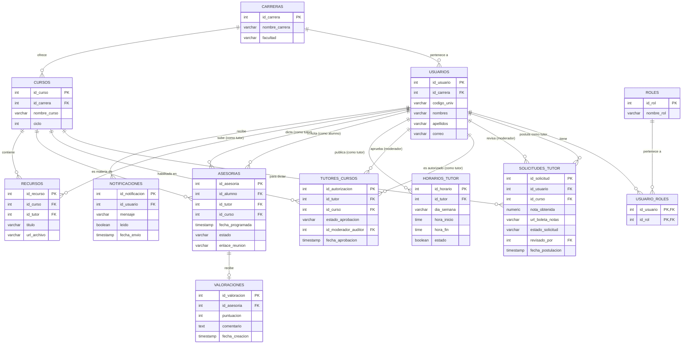

# Diseño de Base de Datos - Portal de Trayectoria y Asesorías Universitarias

**Grupo:** Collao Guevara, Jimena Rosnelly; Cortez Laura, Renzo Jeffrey; Salas Torres, Maricielo Victoria.

## 1. Modelo Entidad-Relación (Mermaid ERD)

## 2. Definición de Tablas

### Tabla: `CARRERAS`
Catálogo de facultades y escuelas profesionales.
| Campo | Tipo | PK/FK | Descripción |
| :--- | :--- | :--- | :--- |
| `id_carrera` | SERIAL | PK | ID único de la carrera. |
| `nombre_carrera`| VARCHAR(100)| | Nombre de la escuela. |
| `facultad` | VARCHAR(100)| | Facultad de origen. |

### Tabla: `USUARIOS`
Entidad central de usuarios del sistema.
| Campo | Tipo | PK/FK | Descripción |
| :--- | :--- | :--- | :--- |
| `id_usuario` | SERIAL | PK | ID único del usuario. |
| `id_carrera` | INT | FK | Carrera a la que pertenece. |
| `codigo_univ` | VARCHAR(20) | | Código de estudiante. |
| `nombres` | VARCHAR(100)| | Nombres. |
| `apellidos` | VARCHAR(100)| | Apellidos. |
| `correo` | VARCHAR(150)| | Correo institucional. |

### Tabla: `SOLICITUDES_TUTOR`
Proceso de postulación para ser tutor de un curso específico.
| Campo | Tipo | PK/FK | Descripción |
| :--- | :--- | :--- | :--- |
| `id_solicitud` | SERIAL | PK | ID de la postulación. |
| `id_usuario` | INT | FK | Estudiante que postula. |
| `id_curso` | INT | FK | Curso que desea dictar. |
| `nota_obtenida` | NUMERIC | | Calificación obtenida en dicho curso. |
| `url_boleta_notas`| VARCHAR(255)| | Evidencia de la nota. |
| `estado_solicitud`| VARCHAR(20) | | Pendiente, Aprobada, Rechazada. |
| `revisado_por` | INT | FK | Coordinador que revisa (id_usuario). |
| `fecha_postulacion`| TIMESTAMP | | Fecha de envío. |

### Tabla: `TUTORES_CURSOS`
Registro oficial de tutores habilitados por curso.
| Campo | Tipo | PK/FK | Descripción |
| :--- | :--- | :--- | :--- |
| `id_autorizacion`| SERIAL | PK | ID de autorización. |
| `id_tutor` | INT | FK | Usuario habilitado como tutor. |
| `id_curso` | INT | FK | Curso habilitado para dictar. |
| `estado_aprobacion`| VARCHAR(20) | | Activo, Inactivo. |
| `id_moderador_auditor`| INT | FK | Coordinador que autorizó (id_usuario). |
| `fecha_aprobacion`| TIMESTAMP | | Fecha de alta en el sistema. |

### Tabla: `HORARIOS_TUTOR`
Bloques de tiempo disponibles publicados por el tutor.
| Campo | Tipo | PK/FK | Descripción |
| :--- | :--- | :--- | :--- |
| `id_horario` | SERIAL | PK | ID de horario. |
| `id_tutor` | INT | FK | Tutor dueño del horario. |
| `dia_semana` | VARCHAR(20) | | Lunes a Domingo. |
| `hora_inicio` | TIME | | Inicio del bloque. |
| `hora_fin` | TIME | | Fin del bloque. |
| `estado` | BOOLEAN | | Disponible/Ocupado. |

### Tabla: `ASESORIAS`
Sesiones de tutoría concertadas.
| Campo | Tipo | PK/FK | Descripción |
| :--- | :--- | :--- | :--- |
| `id_asesoria` | SERIAL | PK | ID de la sesión. |
| `id_alumno` | INT | FK | Estudiante que reserva. |
| `id_tutor` | INT | FK | Tutor que dicta. |
| `id_curso` | INT | FK | Curso de la sesión. |
| `fecha_programada`| TIMESTAMP | | Fecha y hora pactada. |
| `estado` | VARCHAR(20) | | Pendiente, Realizada, Cancelada. |
| `enlace_reunion` | VARCHAR(255)| | Link de Zoom, Meet, Teams, etc. |

### (Otras tablas: ROLES, USUARIO_ROLES, CURSOS, VALORACIONES, RECURSOS, NOTIFICACIONES)
*Definidas con sus PK/FK según el diagrama.*

## 3. Relaciones Críticas
1.  **Moderación (USUARIOS a SOLICITUDES/TUTORES_CURSOS):** Un usuario (Coordinador) puede revisar muchas solicitudes y autorizar a muchos tutores.
2.  **Validación Académica:** Para dictar una `ASESORIA`, el tutor debe figurar previamente con estado 'Activo' en `TUTORES_CURSOS` para ese `id_curso`.
3.  **Doble Rol:** El sistema permite que un `id_usuario` sea Alumno en una asesoría y Tutor en otra.
